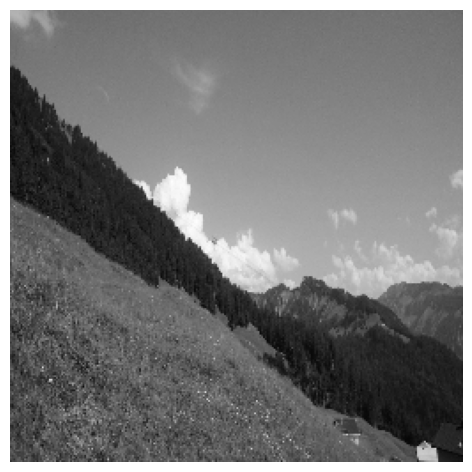
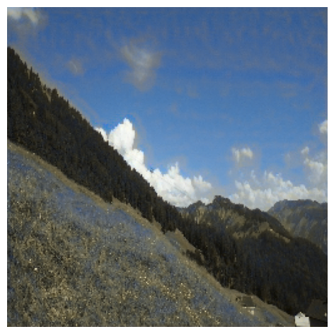
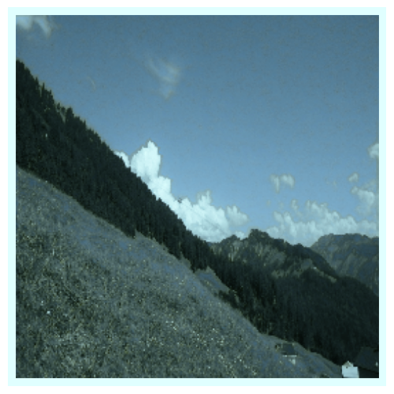
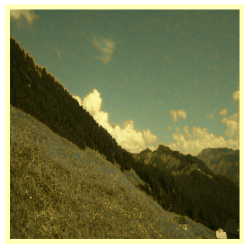

# Image Colorization 
The objective is to produce color images given grayscale input image. 

## Environments
This repository is developed and tested in following environment. 
- `Python` 3.9.7
- `Pytorch` 1.10.0
- `FastAI` 2.5.3
- `OpenCV-python` 4.5.4
- `CUDA` 11.2

See `environments.yml` for details. 


## Usage

### 1. Train

```
python train.py --path-train PATH_TO_TRINING_DATASET \
        --path-val PATH_TO_VALIDATION_DATASET \
        --ptah_trained_model PATH_TO_SAVE_MODEL
```

There are other options for training
- `n-batches`: Number of batch
- `n-epochs`: Number of training epoch
- `path-train`: Path to training dataset
- `path-val`: Path to validation dataset
- `resume`: If `True`, resume training from previously trained model. Default: `False`
- `mode`: `train`: Start Training, `val`: Run validation dataset, `inference`: Run inference
- `lr`: Learning rate. Default: `0.01`
- `device`: `CPU` or `GPU`. Default: `GPU`

### 2. Inference

```
python train.py --mode inference \ 
        --path-inf-img PATH_TO_INPUT \  
        --path-inf-img PATH_TO_OUTPUT \
        --device YOUR_DEVICE
```

- `DEVICE`: `GPU` or `CPU`. Default: `CPU`
- `PATH_TO_INPUT`: Path to Input image you want to colorize. Default: `./test_img.jpg`
- `PATH_TO_OUTPUT`: Path to output image after colorize. Default: `./colorized_img`

A trained model is provided at `trained_model/model_color.pth`. 


#### 2-a. Examples
<p align="center">
    
</p>
<p align=center>
Gray image given to the colorize model. 
</p>

<p align="center">
    
</p>
<p align=center>
Output colorized image. 
</p>
        
<p align="center">
    
</p>
<p align="center">
Cool temperature image applied to colorized image
</p>

<p align="center">
    
</p>
<p align="center">
Warm temperature image applied to colorized image
</p>
### 3. Control Color Temperature

Running following code will produce color-controlled two images (warm and cool). Results will be saved in `./results`. 
 
```
python color_temperature.py --path-img INPUT_IMAGE
```

- `INPUT_IMAGE`: Path to your input image


## Experiments

### Model
- In order to improve quality of reconstructed image, UNet [1] structure is implemented. UNet utilizes lateral connection, which improves the reconstruction quality. Some of the recent works approaches colorization with probabilistic models to deal with one-to-many mapping [2], or with self-attention [4]. In this experiment, however, I stick to supervised learning with UNet architecture. 

- The model in the current experiment uses LAB color space. The model recieves L (representing brightness) channel and outputs predictions of AB channels. Combining L and predicted AB, resulting colorized image is generated. This approach is easier for the model because there are only two channels to predict. 

### Loss functions
- L1 loss and L2 loss are tested. Although it is reported that L2 loss is problematic for some cases [2], and L1 loss is reported to be better for image-to-image translation [3], I observed that using L2 loss produced better or similar colorized images. There are other loss functions related to different training methods [2,3], and those methods might improve colorization performance, but not tried in the current experiment. 

### Metric
- For generative model, quality of generated images is usually measured by Inception Score (IS) and Fréchet Inception Distance (FID) score. Since FID is considered as a better metric than IS, I will talk about FID score. FID measures Fréchet distance between two multivariate Gaussians from two different datasets. In the current experiment, two different datasets would be the training dataset and the collection of the generated images from the model. By feeding those datasets to the Inception network, activation values of a spcific layer can be recorded and the multivariate Gaussians can be obtained from those activation values. Then, there are two multivariate Gaussian distribution corresponding two datasets. The FID measures the distance between them. If FID score is lower, it means the quality of the generated images are close to the original training dataset. 
- Used https://github.com/mseitzer/pytorch-fid for implementation. 

### Color Temperature Control
- Intuitively, color temperature can be controlled by modifying each RGB channel. If I want to make a picture to be warm, addressing R channel while suppressing B channel would work. Similarly, to make images look cooler, addressing B channel while suppressing R channel would work. 
- Then, the issue is the method to address and suppress the channels. We may design a mapping function mapping original pixel intensity of a channel into higher or lower values. It should be efficient and it should not introduce artifacts to the resulting images. 
- See `color_temperature.py` for more details. 


## Reference

[1] Ronneberger, Olaf, Philipp Fischer, and Thomas Brox. "U-net: Convolutional networks for biomedical image segmentation." International Conference on Medical image computing and computer-assisted intervention. Springer, Cham, 2015.

[2] Zhang, Richard, Phillip Isola, and Alexei A. Efros. "Colorful image colorization." European conference on computer vision. Springer, Cham, 2016.

[3] Isola, Phillip, et al. "Image-to-image translation with conditional adversarial networks." Proceedings of the IEEE conference on computer vision and pattern recognition. 2017.

[4] Kumar, Manoj, Dirk Weissenborn, and Nal Kalchbrenner. "Colorization transformer." arXiv preprint arXiv:2102.04432 (2021).

